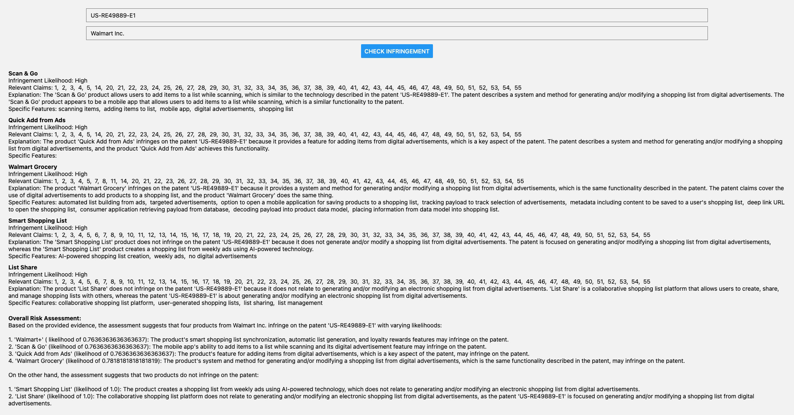
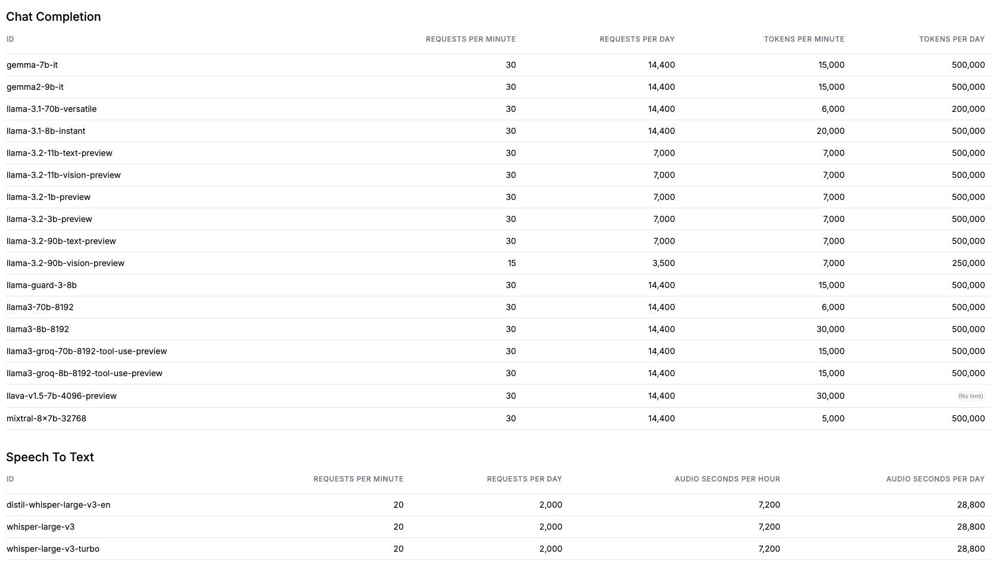

# Patent infrigement detection

## Run w/ docker-compose

```bash
# Build the frontend and backend
./scripts/build_frontend.sh
./scripts/build_backend.sh

cd deployments
docker compose up -d
```



## MVP

- With the help of a GPT model, we will generate a list of keywords from the patent and the company's products
- We will then compare the two lists and return a similarity score

### GPT model

- [Gemini 1.5 Pro](https://ai.google.dev/pricing#1_5pro)
    - (Free) 2 Requests per minute
    - (Free) 50 Requests per day
    - (Free) No context caching
    - (Free/paid) No fine-tuning
    - (Free) No grounding with Google Search
- [Groq](https://groq.com/pricing/)



### Papers

[Can Large Language Models Generate High-quality Patent Claims?](https://arxiv.org/pdf/2406.19465)

> Llama 3 can understand patents and product lists, especially when fine-tuned for such tasks. The Llama-3-FT model, a fine-tuned version of Llama 3, is specifically designed to handle patent descriptions and claims generation, demonstrating improved performance in these areas[1]. This suggests that with appropriate fine-tuning, Llama 3 can effectively process complex documents like patents and potentially understand product lists as well.
> 
> Sources
> - [1] [PDF] arXiv:2406.19465v1 [cs.CL] 27 Jun 2024 http://arxiv.org/pdf/2406.19465.pdf
> - [2] Introducing Meta Llama 3: The most capable openly available LLM ... https://ai.meta.com/blog/meta-llama-3/
> - [3] Llama 3 vs. GPT-4 vs. GPT-4o: Which is Best? | Neoteric https://neoteric.eu/blog/llama-3-vs-gpt-4-vs-gpt-4o-which-is-best/
> - [4] The Battle of the LLMs: Meta's Llama 3 vs. GPT-4 vs. Gemini https://www.capestart.com/resources/blog/the-battle-of-the-llms-llama-3-vs-gpt-4-vs-gemini/
> - [5] Llama 3 70B vs GPT-4: Comparison Analysis https://www.vellum.ai/blog/llama-3-70b-vs-gpt-4-comparison-analysis
> - [6] Llama 3 vs GPT-4: Meta Challenges OpenAI on AI Turf https://beebom.com/llama-3-vs-gpt-4/
> - [7] Using AWS AI chips to quickly deploy Meta LLama 3-powered ... https://aws.amazon.com/blogs/machine-learning/brilliant-words-brilliant-writing-using-aws-ai-chips-to-quickly-deploy-meta-llama-3-powered-applications/
> - [8] LLAMA 3 vs GPT 4 - GeeksforGeeks https://www.geeksforgeeks.org/llama-3-vs-gpt-4/

## Milestones

- Stable prompt
- DB migration
    - https://medium.com/@johnidouglasmarangon/using-migrations-in-python-sqlalchemy-with-alembic-docker-solution-bd79b219d6a#:~:text=Alembic%20is%20a%20database%20migrations,command%20bellow:%20alembic%20init%20migrations
    - https://stackoverflow.com/questions/15660676/alembic-autogenerate-producing-empty-migration
    - https://atlasgo.io/

```bash
# create/edit the models
alembic init migrations
alembic revision --autogenerate -m "create xxx table"
alembic upgrade head
```
